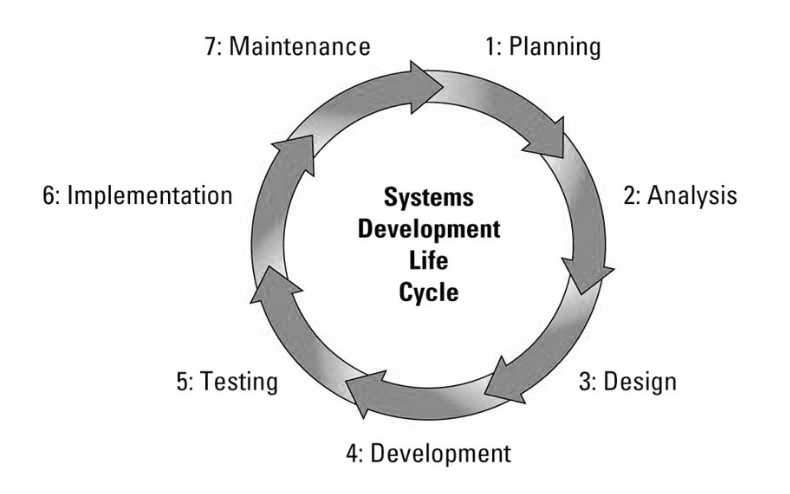

# Unit 2 - Software Development

A program is a set of instructions that accepts input, processes them, and produces an output, or redirects it to another program. A program may be a complete structure or it may be a part of another program, whose collection is also referred to as software. Program development is an individual activity in which a programmer writes a program or component that is used for combining with other programs.

Extension professional fellows use a systematic process called program development to plan, implement, and evaluate their programs. A computer program, as we all know, is a collection of computer characters, symbols, and instructions. A program, also known as a driver and operator for a computer system, is a set of instructions that tells the computer how to run. The program aids in the operation of the computer system in the manner that we wish.

## Introduction to Software Development

Software development is the process of creating, designing, testing, and maintaining computer programs and applications. It involves a series of systematic steps that aim to produce high-quality software that meets user requirements. Software development is a dynamic field that continues to evolve with advancements in technology and changing user needs.

Key components of software development include:

1. **Planning and Analysis:**

   - **Requirements Gathering:** Understanding and documenting the needs and expectations of the end-users and stakeholders.
   - **Feasibility Study:** Assessing the practicality and viability of the proposed software project in terms of technology, resources, and budget.

2. **Design:**

   - **Architectural Design:** Creating a high-level structure of the software, defining components and their relationships.
   - **Detailed Design:** Developing detailed specifications for each component, including algorithms, data structures, and interfaces.

3. **Development:**

   - **Coding:** Writing the actual source code in a programming language.
   - **Unit Testing:** Verifying the functionality of individual units or modules of code.

4. **Testing:**

   - **Integration Testing:** Combining and testing different modules together to ensure they work seamlessly.
   - **System Testing:** Assessing the entire system to ensure it meets the specified requirements.
   - **User Acceptance Testing (UAT):** Evaluating the software with end-users to ensure it meets their expectations.

5. **Deployment/Implementation:**

   - **Installation:** Deploying the software in a production environment.
   - **Training:** Providing training to end-users and support staff.

6. **Maintenance:**

   - **Bug Fixing:** Identifying and resolving defects or issues in the software.
   - **Updates and Enhancements:** Introducing new features or improving existing ones based on user feedback and changing requirements.

7. **Project Management:**

   - **Scheduling:** Creating timelines and assigning tasks to ensure the project stays on track.
   - **Resource Management:** Allocating and managing human and technological resources efficiently.
   - **Version Control:** Tracking changes to the source code and coordinating collaboration among developers.

8. **Documentation:**

   - **Technical Documentation:** Creating detailed documentation for developers, including code comments and API documentation.
   - **User Documentation:** Providing manuals and guides for end-users.

9. **Collaboration and Communication:**
   - **Team Collaboration:** Working in teams to divide tasks and collaborate on different aspects of the project.
   - **Communication:** Maintaining effective communication with stakeholders to understand requirements and provide updates on progress.

## Program Development Life Cycle

The Program Development Life Cycle (PDLC) is a set of processes or phases that guide the development of computer programs or software applications. It is a framework that outlines the stages through which a software project progresses, from conception to deployment and maintenance. The PDLC is also known as the Software Development Life Cycle (SDLC).

1. **Planning:**

   - **Objective:** Identify the problem or need the software will address.
   - **Feasibility Study:** Assess technical, operational, and economic feasibility.
   - **Project Plan:** Develop a detailed plan outlining tasks, resources, timelines, and milestones.

2. **Analysis:**

   - **Requirements Gathering:** Understand and document user and stakeholder needs.
   - **Problem Definition:** Clearly define the problem that the software will solve.
   - **Feasibility Assessment:** Analyze the feasibility of the proposed solution.

3. **Design:**

   - **System Architecture:** Design the overall structure, including components and interactions.
   - **Database Design:** Plan the organization and structure of the data.
   - **User Interface Design:** Create the visual and interactive aspects for user interaction.

4. **Development:**

   - **Coding:** Write source code based on design specifications.
   - **Implementation:** Convert design into a working system.
   - **Unit Testing:** Verify the functionality of individual code units.

5. **Testing:**

   - **Integration Testing:** Combine and test individual modules to ensure they work together.
   - **System Testing:** Verify that the entire system meets specified requirements.
   - **User Acceptance Testing (UAT):** Conduct testing with end-users to validate satisfaction.

6. **Implementation:**

   - **Installation:** Deploy the software in the production environment.
   - **Training:** Provide training to end-users and support staff.
   - **Monitoring:** Address any issues that arise during the initial deployment.

7. **Maintenance:**

   - **Bug Fixing:** Identify and resolve issues reported by users.
   - **Updates and Enhancements:** Introduce new features or improvements.
   - **Performance Monitoring:** Continuously monitor and optimize software performance.

8. **Documentation:**
   - **Technical Documentation:** Create detailed documentation for developers, including code comments and API documentation.
   - **User Documentation:** Develop manuals and guides for end-users.

### Problem Identifications

Identifying and defining the problem is a crucial step in the software development process. A well-defined problem statement lays the foundation for a successful project. Here are key points regarding problem identification:

1. **User Needs and Expectations:**

   - Understand the needs and expectations of end-users and stakeholders.
   - Gather input from potential users to ensure the software addresses real-world challenges.

2. **Stakeholder Involvement:**

   - Engage with stakeholders, including clients, users, and anyone impacted by the software.
   - Identify their perspectives, concerns, and requirements.

3. **Market Research:**

   - Conduct market research to understand the competitive landscape and existing solutions.
   - Identify opportunities for innovation and improvement.

4. **Feasibility Analysis:**

   - Assess the technical, operational, and economic feasibility of the proposed software.
   - Consider factors such as technology constraints, available resources, and budget limitations.

5. **Problem Definition:**

   - Clearly define the problem that the software aims to solve.
   - Articulate the problem statement in a concise and unambiguous manner.

6. **Scope Definition:**

   - Define the scope of the project by specifying what the software will and will not do.
   - Establish boundaries and limitations to manage expectations.

7. **Risk Assessment:**

   - Identify potential risks and challenges associated with solving the problem.
   - Evaluate the impact of these risks on the project's success.

8. **User Stories or Use Cases:**

   - Create user stories or use cases to capture specific scenarios in which the software will be used.
   - Describe how users will interact with the software to achieve their goals.

9. **Validation with Stakeholders:**

   - Validate the problem statement and proposed solutions with stakeholders.
   - Ensure alignment between the problem definition and the expectations of those involved.

10. **Documentation:**
    - Document the problem statement and related information.
    - Maintain a record of discussions, decisions, and any changes to the problem definition.

## Problem Analysis/ Requirements Analysis

Problem analysis, also known as requirements analysis, is a critical phase in the software development life cycle. During this stage, the focus is on understanding and documenting the detailed requirements of the software system.

1. **Stakeholder Collaboration:**

   - Collaborate with stakeholders, including end-users, clients, and subject matter experts.
   - Gather insights into their needs, expectations, and the context in which the software will be used.

2. **Elicitation Techniques:**

   - Use various elicitation techniques such as interviews, surveys, workshops, and observations to gather requirements.
   - Employ both formal and informal methods to capture a comprehensive set of requirements.

3. **Functional Requirements:**

   - Identify and document the functional requirements that describe the system's behavior and capabilities.
   - Specify what the software should do in response to various inputs and under different conditions.

4. **Non-Functional Requirements:**

   - Capture non-functional requirements related to performance, security, usability, and other quality attributes.
   - Define constraints and criteria that impact the system's overall performance and user experience.

5. **Use Cases and User Stories:**

   - Develop use cases or user stories to illustrate how users interact with the system.
   - Provide scenarios that demonstrate specific interactions and outcomes.

6. **Requirement Prioritization:**

   - Prioritize requirements based on their importance to stakeholders and project goals.
   - Distinguish between "must-have" and "nice-to-have" features.

7. **Traceability:**

   - Establish traceability between requirements to ensure that each requirement is linked to its source and can be tracked throughout the development process.
   - Enable better management of changes and impact analysis.

8. **Validation with Stakeholders:**

   - Review and validate requirements with stakeholders to ensure accuracy and completeness.
   - Confirm that the documented requirements align with their expectations.

9. **Prototyping:**

   - Develop prototypes or mockups to visualize the proposed system and gather additional feedback.
   - Use prototypes to validate user interface design and gather insights into user preferences.

10. **Documentation:**

    - Document requirements in a clear, concise, and unambiguous manner.
    - Maintain a comprehensive requirements document that serves as a reference for the development team.

11. **Change Management:**
    - Establish a process for managing changes to requirements.
    - Document and communicate changes, and assess their impact on the project timeline and budget.

Clear and well-documented requirements serve as the basis for subsequent phases, including design, development, and testing, contributing to the overall success of the software project.

| Aspect                       | Functional Requirements                                                                     | Non-Functional Requirements                                                                                      |
| ---------------------------- | ------------------------------------------------------------------------------------------- | ---------------------------------------------------------------------------------------------------------------- |
| **Definition**               | Describes what the system is supposed to do.                                                | Describes how the system should perform its functions.                                                           |
| **Focus**                    | Concentrates on the behavior and features of the system.                                    | Concentrates on system attributes and characteristics.                                                           |
| **Examples**                 | User authentication, data validation, report generation, etc.                               | Performance, reliability, usability, security, etc.                                                              |
| **What they address**        | Specific functionalities and features that users need.                                      | Quality attributes or characteristics of the system.                                                             |
| **Measurability**            | Can often be measured objectively based on user interactions.                               | Often involves subjective assessments or quality metrics.                                                        |
| **Change Frequency**         | Likely to change more frequently as user needs evolve.                                      | Tends to be more stable and less subject to frequent changes.                                                    |
| **Dependencies**             | Tightly linked to user expectations and business processes.                                 | Influenced by technical, organizational, and environmental factors.                                              |
| **Scope**                    | Directly impacts user interactions and system behavior.                                     | Affects overall system performance and user satisfaction.                                                        |
| **Testing Emphasis**         | Tested through user acceptance testing and functional testing.                              | Requires specific types of testing (e.g., performance testing, security testing).                                |
| **Documentation**            | Described through use cases, user stories, and functional specifications.                   | Documented through performance requirements, security policies, etc.                                             |
| **Examples of Requirements** | - The system shall allow users to log in.   - The system shall generate monthly reports. | - The system response time shall be less than 2 seconds.   - The system shall be available 99.9% of the time. |

## Program Design

Program design, also known as software design, is a crucial phase in the software development life cycle where the overall structure and organization of the software system are defined. The primary goal of program design is to transform the requirements specified during earlier phases into a detailed and comprehensive blueprint that can be used for actual implementation. Here are key aspects of program design:

1. **System Architecture:**
   - Define the high-level structure of the system, including components, modules, and their interactions.
   - Choose an appropriate architectural style, such as client-server, microservices, or layered architecture.

2. **Module Design:**
   - Break down the system into smaller, manageable modules or components.
   - Specify the functionality and responsibilities of each module.

3. **Data Design:**
   - Design the data structures that will be used to store and manage information within the system.
   - Define databases, tables, relationships, and data flow.

4. **Interface Design:**
   - Create interfaces for user interactions, specifying the layout and behavior of the user interface (UI).
   - Design APIs (Application Programming Interfaces) for communication between different software components.

5. **Algorithm Design:**
   - Develop algorithms and logic for key functionalities within the system.
   - Optimize algorithms for performance and efficiency.

6. **Error Handling:**
   - Plan for error handling and recovery mechanisms to ensure robustness.
   - Define how the system should respond to unexpected situations or user errors.

7. **Security Design:**
   - Incorporate security measures to protect the system from unauthorized access and data breaches.
   - Implement encryption, access controls, and other security features.

8. **Scalability and Performance:**
   - Consider scalability requirements and design the system to handle growth in data volume or user load.
   - Optimize for performance by considering factors like response time and resource utilization.

9. **Reuse and Maintainability:**
   - Encourage code reuse by designing modular and reusable components.
   - Ensure that the system is maintainable by following coding standards and best practices.

10. **Technology Selection:**
    - Choose appropriate technologies, frameworks, and tools for implementation.
    - Consider factors like platform compatibility, ease of maintenance, and community support.

11. **Documentation:**
    - Document the design decisions, architectural choices, and rationale behind the chosen solutions.
    - Create technical documentation that serves as a guide for developers and future maintainers.

12. **Review and Validation:**
    - Conduct design reviews to ensure that the proposed design meets the specified requirements.
    - Validate the design against performance, security, and other non-functional requirements.

## Development

The development phase is a crucial stage in the software development life cycle (SDLC) where the actual code for the software is written, and the system is built based on the design specifications. This phase follows the problem analysis, requirements analysis, and design phases, and it precedes testing, deployment, and maintenance. Here are key aspects of the development phase:

1. **Coding:**
   - **Definition:** Writing the source code based on the detailed design specifications.
   - **Activities:**
     - Developers translate design documents into executable code.
     - Follow coding standards and best practices.
     - Implement algorithms and logic defined during the design phase.

2. **Unit Testing:**
   - **Definition:** Verifying the functionality of individual units or modules of code.
   - **Activities:**
     - Test each module in isolation to ensure it works as intended.
     - Identify and fix any defects or errors within individual units.

3. **Integration Testing:**
   - **Definition:** Combining and testing different modules together to ensure they work seamlessly as a whole.
   - **Activities:**
     - Verify that modules interact correctly and share data as expected.
     - Detect and address integration issues.

4. **Debugging:**
   - **Definition:** Identifying and fixing defects, errors, or issues in the code.
   - **Activities:**
     - Debug code to identify the root cause of issues.
     - Fix bugs and address any unexpected behavior.

5. **Refactoring:**
   - **Definition:** Restructuring or optimizing the code without changing its external behavior.
   - **Activities:**
     - Improve code readability, maintainability, and efficiency.
     - Address technical debt and enhance code quality.

6. **Version Control:**
   - **Definition:** Tracking changes to the source code and coordinating collaboration among developers.
   - **Activities:**
     - Use version control systems (e.g., Git) to manage and track code changes.
     - Collaborate with other developers, ensuring code consistency.

7. **Code Reviews:**
   - **Definition:** Evaluating the code by peers to identify issues, share knowledge, and ensure quality.
   - **Activities:**
     - Conduct peer code reviews to catch errors and improve code quality.
     - Share insights and provide feedback on coding practices.

8. **Documentation:**
   - **Definition:** Creating documentation that aids understanding and future development.
   - **Activities:**
     - Document code comments, explaining the purpose of functions and sections.
     - Update technical documentation to reflect changes.

9. **Performance Optimization:**
   - **Definition:** Enhancing the software's performance by optimizing code and algorithms.
   - **Activities:**
     - Identify and address bottlenecks affecting system performance.
     - Optimize algorithms and data structures.

10. **Adherence to Design:**
    - **Definition:** Ensuring that the implemented code aligns with the design specifications.
    - **Activities:**
      - Verify that the coding follows the architecture and design patterns.
      - Address any deviations from the original design.

11. **Security Measures:**
    - **Definition:** Implementing security features and best practices to protect the software.
    - **Activities:**
      - Address potential security vulnerabilities in the code.
      - Incorporate encryption, authentication, and authorization mechanisms.

12. **Build and Compilation:**
    - **Definition:** Compiling source code into executable files or libraries.
    - **Activities:**
      - Use build tools to compile and link code components.
      - Generate executable files ready for testing and deployment.

13. **Continuous Integration:**
    - **Definition:** Integrating code changes into a shared repository multiple times a day.
    - **Activities:**
      - Automate the process of integrating code changes.
      - Execute automated builds and tests upon each integration.

14. **Collaboration and Communication:**
    - **Definition:** Maintaining effective communication within the development team.
    - **Activities:**
      - Collaborate with team members on code-related tasks.
      - Communicate progress, challenges, and solutions.

15. **Development Environment Setup:**
    - **Definition:** Configuring and maintaining the development environment.
    - **Activities:**
      - Ensure that development tools, libraries, and dependencies are properly configured.
      - Address any issues related to the development environment.

16. **Adaptation to Changes:**
    - **Definition:** Adapting the codebase to accommodate changes in requirements or design.
    - **Activities:**
      - Modify code to incorporate changes based on feedback or evolving requirements.
      - Ensure that changes do not introduce regressions.

## Testing
Testing is a critical phase in the software development life cycle (SDLC) that ensures the software meets the specified requirements, functions as intended, and is free from defects. The primary goal of testing is to identify and fix errors before the software is deployed to users. Here are key aspects of the testing phase:

1. **Types of Testing:**
   - **Unit Testing:**
     - **Definition:** Testing individual units or modules of code in isolation to verify their correctness.
     - **Activities:** Developers write tests to ensure that each unit functions as intended.

   - **Integration Testing:**
     - **Definition:** Verifying the interactions between integrated modules to ensure they work together seamlessly.
     - **Activities:** Testing the combined functionality of multiple units to detect integration issues.

   - **System Testing:**
     - **Definition:** Evaluating the entire system's functionality to ensure it meets specified requirements.
     - **Activities:** Verifying that the software performs as expected in a complete, integrated environment.

   - **User Acceptance Testing (UAT):**
     - **Definition:** Testing the software with end-users to validate that it meets their expectations.
     - **Activities:** Users assess whether the software aligns with their needs and requirements.

   - **Performance Testing:**
     - **Definition:** Assessing the software's responsiveness, scalability, and stability under various conditions.
     - **Activities:** Evaluating factors such as response time, throughput, and resource usage.

   - **Security Testing:**
     - **Definition:** Identifying vulnerabilities and weaknesses in the software's security measures.
     - **Activities:** Assessing the system for potential security risks and implementing measures to address them.

   - **Regression Testing:**
     - **Definition:** Ensuring that new changes or features do not negatively impact existing functionalities.
     - **Activities:** Re-running tests on previously tested parts of the system after changes are made.

   - **Automated Testing:**
     - **Definition:** Using automated scripts to execute tests and verify software functionality.
     - **Activities:** Writing and maintaining scripts that automatically perform tests, improving efficiency.

   - **Load Testing:**
     - **Definition:** Assessing the system's performance under expected or higher-than-expected user loads.
     - **Activities:** Simulating high user traffic to identify performance bottlenecks.

   - **Stress Testing:**
     - **Definition:** Evaluating the system's robustness by subjecting it to extreme conditions.
     - **Activities:** Assessing how the system handles resource exhaustion or extreme user loads.

2. **Test Planning:**
   - **Definition:** Developing a comprehensive test plan that outlines the testing strategy, scope, resources, and schedule.
   - **Activities:** Defining test objectives, selecting testing methods, and allocating resources for testing.

3. **Test Case Design:**
   - **Definition:** Creating detailed test cases that specify inputs, expected outcomes, and conditions for executing tests.
   - **Activities:** Designing test cases based on requirements and functional specifications.

4. **Test Execution:**
   - **Definition:** Running the tests based on the test plan and executing test cases.
   - **Activities:** Applying the predefined test cases to the software and documenting the results.

5. **Defect Tracking and Management:**
   - **Definition:** Identifying and documenting defects, issues, or deviations from expected behavior.
   - **Activities:** Logging and prioritizing defects, communicating with developers, and tracking resolution progress.

6. **Test Reporting:**
   - **Definition:** Communicating the results of testing activities to stakeholders.
   - **Activities:** Generating and sharing reports on test progress, test coverage, and defect status.

7. **Continuous Improvement:**
   - **Definition:** Learning from testing experiences and improving testing processes.
   - **Activities:** Conducting post-mortem reviews, analyzing testing outcomes, and updating test processes for future projects.

8. **User Feedback Incorporation:**
   - **Definition:** Incorporating user feedback gathered during testing into the development process.
   - **Activities:** Adapting the software based on user suggestions and addressing identified issues.

9. **Adaptation to Changes:**
   - **Definition:** Modifying test plans and test cases to accommodate changes in requirements or design.
   - **Activities:** Updating testing documentation and procedures to align with evolving project requirements.

10. **Regression Test Automation:**
    - **Definition:** Automating repetitive regression tests to ensure consistent and efficient testing.
    - **Activities:** Developing and maintaining automated scripts to execute regression tests.

11. **Test Environment Setup:**
    - **Definition:** Preparing and configuring the test environment to mimic the production environment.
    - **Activities:** Ensuring that the testing environment mirrors the conditions of the actual deployment environment.

12. **Exploratory Testing:**
    - **Definition:** Informal testing where testers explore the application to identify defects without predefined test cases.
    - **Activities:** Creatively and systematically exploring the application to discover unexpected issues.

13. **Usability Testing:**
    - **Definition:** Evaluating the software's user-friendliness and overall user experience.
    - **Activities:** Assessing how easily users can interact with and navigate the software.

14. **Alpha and Beta Testing:**
    - **Definition:** Conducting testing with a limited group of users (alpha) and a broader user audience (beta).
    - **Activities:** Gathering feedback from early adopters and a larger user base to identify issues.

15. **Post-Release Monitoring:**
    - **Definition:** Continuously monitoring the software's performance and user feedback after release.
    - **Activities:** Addressing issues, collecting user feedback, and planning future updates based on post-release data.

Effective testing is essential for delivering a high-quality software product that meets user expectations and performs reliably in various conditions. Testing is an iterative process that continues throughout the software development life cycle (SDLC), from the initial planning phase to post-release monitoring.

## Implementation
Implementation/Deployment is the process of making a software application available for use in a specific environment, typically the production environment. It involves transferring the application from development and testing environments to a live environment where end-users can access and use it. The deployment phase is a crucial step in the software development life cycle (SDLC) that follows implementation and precedes ongoing maintenance. Here are key aspects of the deployment phase:

1. **Release Planning:**
   - **Definition:** Planning the release of the software into the production environment.
   - **Activities:**
     - Determining the scope of the release.
     - Identifying the features and changes included in the release.

2. **Environment Preparation:**
   - **Definition:** Preparing the production environment to host the software.
   - **Activities:**
     - Configuring servers, databases, and other necessary infrastructure.
     - Ensuring that the production environment mirrors the configurations used during testing.

3. **Database Migration:**
   - **Definition:** Transferring and updating the database to reflect any changes made during the implementation phase.
   - **Activities:**
     - Executing database scripts to apply schema changes.
     - Verifying the integrity of the migrated data.

4. **Deployment Scripting:**
   - **Definition:** Creating scripts or automation tools to streamline the deployment process.
   - **Activities:**
     - Writing scripts to automate the copying of files, database updates, and other deployment tasks.
     - Ensuring that deployment scripts are version-controlled and well-documented.

5. **Rollout Strategy:**
   - **Definition:** Planning the sequence and method of deploying the software to minimize downtime and user impact.
   - **Activities:**
     - Defining a rollout plan that specifies the order in which components are deployed.
     - Considering strategies for rollback in case of issues.

6. **Deployment Execution:**
   - **Definition:** Executing the deployment plan to make the software live in the production environment.
   - **Activities:**
     - Transferring code and configuration files to production servers.
     - Applying necessary updates to the database.

7. **Smoke Testing:**
   - **Definition:** Performing a quick round of tests to verify that the deployed software is functional.
   - **Activities:**
     - Conducting basic tests to ensure that critical functionalities work as expected.
     - Identifying and addressing any immediate issues.

8. **Monitoring and Observability:**
   - **Definition:** Setting up monitoring tools to track the performance and health of the deployed software.
   - **Activities:**
     - Configuring monitoring systems to detect anomalies.
     - Establishing alerts for potential issues.

9. **Validation and Verification:**
   - **Definition:** Ensuring that the deployed software meets the specified requirements and performs as expected.
   - **Activities:**
     - Validating that all features work correctly in the production environment.
     - Verifying that the software meets performance and security standards.

10. **User Acceptance:**
    - **Definition:** Confirming that end-users can access and use the software without issues.
    - **Activities:**
      - Communicating with end-users to verify successful deployment.
      - Addressing any user-reported issues promptly.

11. **Documentation Update:**
    - **Definition:** Updating documentation to reflect changes made during deployment.
    - **Activities:**
      - Documenting any configuration changes or updates made during deployment.
      - Updating user manuals and technical documentation.

12. **Handover to Support:**
    - **Definition:** Transitioning the responsibility for ongoing support and maintenance to the support team.
    - **Activities:**
      - Providing support teams with necessary information, documentation, and training.
      - Establishing communication channels for issue reporting and resolution.

13. **Post-Deployment Review:**
    - **Definition:** Conducting a review of the deployment process to identify areas for improvement.
    - **Activities:**
      - Analyzing the deployment process for efficiency and effectiveness.
      - Capturing lessons learned and updating deployment procedures.

14. **Rollback Plan Activation (if needed):**
    - **Definition:** Implementing a rollback plan in case critical issues arise after deployment.
    - **Activities:**
      - Activating the rollback plan if unexpected issues impact the system's functionality.
      - Reverting to the previous version of the software.

15. **Communication:**
    - **Definition:** Communicating the successful deployment to stakeholders and end-users.
    - **Activities:**
      - Sending notifications to inform stakeholders about the completed deployment.
      - Providing relevant information on new features or changes.

16. **Post-Deployment Monitoring:**
    - **Definition:** Continuing to monitor the deployed software after the initial rollout.
    - **Activities:**
      - Monitoring system performance and user feedback.
      - Addressing any issues that arise in the live environment.

Successful deployment ensures that the software is available for use by end-users, meeting their needs and expectations. It involves careful planning, coordination, and validation to minimize disruptions and ensure a smooth transition from development to production.

## Maintenance

Maintenance is the phase in the software development life cycle (SDLC) that involves managing and enhancing the software product after it has been deployed and is in active use. The maintenance phase is crucial for addressing issues, incorporating updates, and ensuring the continued reliability and performance of the software. Here are key aspects of the maintenance phase:

1. **Types of Maintenance:**
   - **Corrective Maintenance:**
     - **Definition:** Addressing and fixing defects, bugs, or issues identified in the deployed software.
     - **Activities:** Analyzing reported issues, prioritizing them, and releasing patches or updates to resolve problems.

   - **Adaptive Maintenance:**
     - **Definition:** Making changes to the software to adapt it to changes in the external environment, such as hardware or operating system upgrades.
     - **Activities:** Updating the software to ensure compatibility with new platforms or technologies.

   - **Perfective Maintenance:**
     - **Definition:** Enhancing and optimizing the software to improve its performance, usability, or efficiency.
     - **Activities:** Implementing new features, refining existing functionalities, and optimizing code for better performance.

   - **Preventive Maintenance:**
     - **Definition:** Proactively identifying and addressing potential issues before they lead to problems.
     - **Activities:** Conducting regular code reviews, implementing security updates, and applying performance enhancements.

2. **Bug Tracking and Resolution:**
   - **Definition:** Identifying, tracking, and resolving reported bugs and issues.
   - **Activities:** Using bug tracking tools to log, prioritize, and assign issues to development teams.
   - Developing and releasing patches or updates to address reported bugs.

3. **Performance Monitoring and Optimization:**
   - **Definition:** Continuously monitoring the software's performance and optimizing it for efficiency.
   - **Activities:** Analyzing system performance metrics, identifying bottlenecks, and implementing optimizations.
   - Ensuring that the software can handle increased loads and user demands.

4. **Security Updates:**
   - **Definition:** Implementing measures to address and mitigate security vulnerabilities.
   - **Activities:** Regularly updating security protocols, applying patches for known vulnerabilities, and conducting security audits.
   - Responding to emerging security threats and proactively enhancing security measures.

5. **User Support:**
   - **Definition:** Providing ongoing support to end-users who encounter issues or have questions.
   - **Activities:** Maintaining a helpdesk or support system for users to report issues.
   - Offering assistance, guidance, and training to users as needed.

6. **Documentation Update:**
   - **Definition:** Updating documentation to reflect changes made during the maintenance phase.
   - **Activities:** Documenting bug fixes, feature enhancements, and any modifications made to the software.
   - Keeping user manuals and technical documentation up to date.

7. **Release Management:**
   - **Definition:** Managing the release of updates, patches, or new versions of the software.
   - **Activities:** Planning and coordinating release schedules.
   - Communicating release notes and change logs to users and stakeholders.

8. **Change Management:**
   - **Definition:** Managing and controlling changes to the software to minimize disruptions.
   - **Activities:** Implementing a formalized change management process to evaluate, approve, and implement changes.
   - Ensuring that changes are tested and validated before deployment.

9. **Version Control:**
   - **Definition:** Managing different versions of the software codebase.
   - **Activities:** Using version control systems to track changes, tag releases, and manage branches.
   - Ensuring that development, testing, and production environments are synchronized.

10. **End-of-Life Planning:**
    - **Definition:** Planning for the eventual retirement or replacement of the software.
    - **Activities:** Evaluating the long-term viability of the software.
    - Developing a plan for transitioning users to newer versions or alternative solutions.

11. **Knowledge Transfer:**
    - **Definition:** Transferring knowledge about the software to new team members or support personnel.
    - **Activities:** Documenting system architecture, design decisions, and key functionalities.
    - Facilitating knowledge-sharing sessions and training for new team members.

12. **User Feedback Analysis:**
    - **Definition:** Analyzing user feedback to identify areas for improvement and gather insights.
    - **Activities:** Reviewing user-reported issues and suggestions.
    - Incorporating user feedback into the development roadmap.

13. **Performance Reporting:**
    - **Definition:** Providing regular reports on system performance and maintenance activities.
    - **Activities:** Generating reports on bug resolutions, performance improvements, and user support metrics.
    - Communicating performance insights to stakeholders.

14. **Continuous Improvement:**
    - **Definition:** Iteratively improving maintenance processes based on lessons learned.
    - **Activities:** Conducting post-mortem reviews after major updates or incidents.
    - Implementing process improvements to enhance efficiency and effectiveness.

The maintenance phase is ongoing and ensures that the software remains relevant, reliable, and aligned with user needs and expectations throughout its lifecycle. It involves a combination of proactive measures, ongoing support, and strategic planning to address evolving challenges and opportunities.

## Documentation

Documentation is an essential aspect of the software development life cycle (SDLC) that involves creating and maintaining records, manuals, guides, and other written materials to support the development, deployment, and maintenance of a software system. Documentation serves as a reference for developers, testers, users, and other stakeholders, providing critical information about the software and its various aspects. Here are key aspects of documentation in the context of software development:

1. **Types of Documentation:**
   - **Requirements Documentation:**
     - **Definition:** Describing the functional and non-functional requirements of the software.
     - **Contents:** Use cases, user stories, system specifications, and acceptance criteria.

   - **Design Documentation:**
     - **Definition:** Detailing the architecture, data structures, algorithms, and design decisions of the software.
     - **Contents:** System architecture diagrams, class diagrams, sequence diagrams, and database schemas.

   - **Technical Documentation:**
     - **Definition:** Providing detailed information for developers about the codebase and technical aspects of the software.
     - **Contents:** Code comments, API documentation, coding standards, and technical guides.

   - **User Documentation:**
     - **Definition:** Offering guidance and instructions for end-users on how to use the software.
     - **Contents:** User manuals, tutorials, FAQs, and help documentation.

   - **Testing Documentation:**
     - **Definition:** Recording testing strategies, test plans, test cases, and test results.
     - **Contents:** Test plans, test cases, test scripts, and test reports.

   - **Deployment Documentation:**
     - **Definition:** Guiding the deployment of the software in different environments.
     - **Contents:** Deployment plans, installation guides, and configuration instructions.

   - **Maintenance Documentation:**
     - **Definition:** Documenting processes related to ongoing maintenance, bug tracking, and support.
     - **Contents:** Bug reports, change logs, release notes, and support manuals.

   - **Project Management Documentation:**
     - **Definition:** Documenting project plans, schedules, and status reports.
     - **Contents:** Project plans, Gantt charts, progress reports, and meeting minutes.

2. **Importance of Documentation:**
   - **Communication:**
     - Facilitates effective communication among team members, stakeholders, and users.

   - **Knowledge Transfer:**
     - Enables the transfer of knowledge from one team member to another, ensuring continuity.

   - **Onboarding:**
     - Aids in the onboarding process for new team members by providing essential information.

   - **Problem Solving:**
     - Serves as a resource for troubleshooting, debugging, and resolving issues.

   - **Compliance:**
     - Supports compliance with industry standards, regulations, and best practices.

   - **User Support:**
     - Assists end-users in understanding and effectively using the software.

   - **Risk Management:**
     - Mitigates risks associated with knowledge loss, misunderstandings, and miscommunications.

   - **Decision-Making:**
     - Provides information for informed decision-making throughout the SDLC.

3. **Best Practices for Documentation:**
   - **Consistency:**
     - Maintain consistency in format, structure, and terminology across all documentation.

   - **Clarity and Conciseness:**
     - Ensure that documentation is clear, concise, and easy to understand.

   - **Version Control:**
     - Use version control systems to manage changes and updates to documentation.

   - **Accessibility:**
     - Make documentation easily accessible to all relevant stakeholders.

   - **Regular Updates:**
     - Keep documentation up to date with changes in the software and project.

   - **Collaboration:**
     - Encourage collaboration in the documentation process, involving relevant team members.

   - **Review and Validation:**
     - Conduct regular reviews and validations of documentation for accuracy and completeness.

   - **Templates:**
     - Use standardized templates to create consistent and professional-looking documents.

   - **Automation:**
     - Explore automation tools for generating documentation from code or other sources.

   - **Documentation as Code:**
     - Adopt the "Documentation as Code" philosophy to treat documentation like software code.

4. **Tools for Documentation:**
   - **Version Control Systems:**
     - Git, SVN

   - **Documentation Generators:**
     - Javadoc, Doxygen, Sphinx, MkDocs

   - **Collaboration Tools:**
     - Confluence, SharePoint, Google Docs

   - **Diagramming Tools:**
     - Draw.io, Lucidchart, Microsoft Visio

   - **Project Management Tools:**
     - Jira, Trello, Asana

   - **Text Editors and IDEs:**
     - Visual Studio Code, Sublime Text, IntelliJ IDEA

   - **Wikis:**
     - MediaWiki, DokuWiki

   - **Communication Tools:**
     - Slack, Microsoft Teams, Zoom

Documentation is an integral part of the software development process, contributing to the success of projects by fostering collaboration, knowledge sharing, and effective communication among team members and stakeholders.

